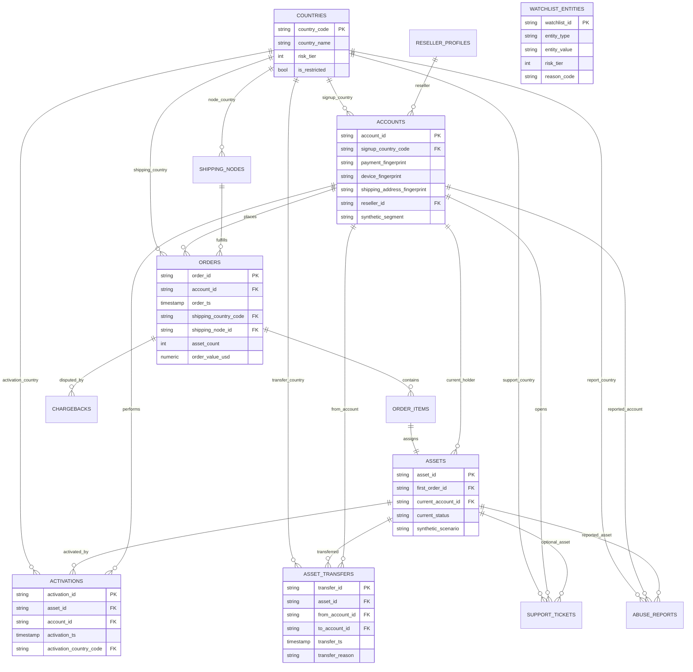

# Schema ERD

This diagram shows the synthetic SQL Risk Lab schema. The Olist companion case study has a separate public dataset schema under `case_studies/olist_marketplace_integrity/`.

## Read Path

The core investigation path starts with `accounts`, `orders`, and `assets`, then joins to `activations`, `asset_transfers`, `abuse_reports`, and `chargebacks`. `watchlist_entities` is intentionally generic and fake; it demonstrates matching logic without using real restricted-party data.

